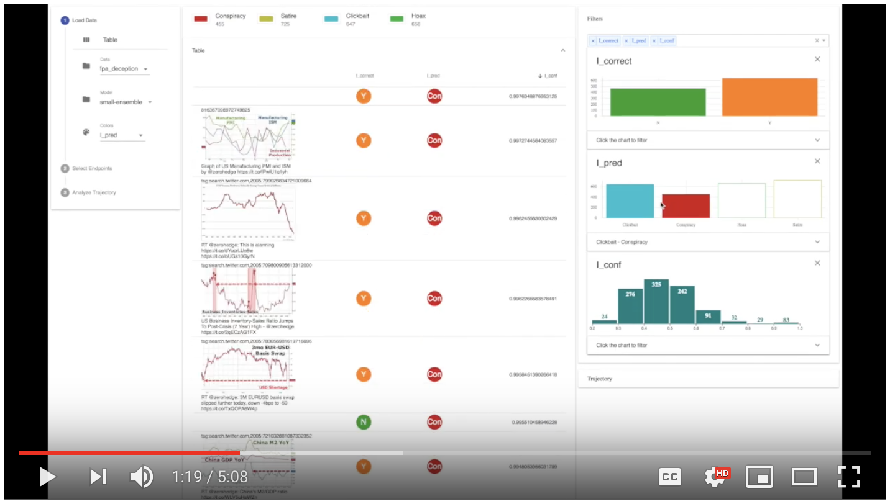

# Explaining Deceptive News Prediction Models 
### Ayton E.M., B.J. Hutchinson, D.L. Arendt, and S. Volkova.
### ICWSM'19 Poster Session

Social media plays a valuable role in rapid news dissemination, but it also serves as a vehicle to propagate unverified information. For example, news shared on Facebook or Twitter may actually contain disinformation, propaganda, hoaxes, conspiracies, clickbait or satire. This paper presents an in-depth analysis of the behavior of suspicious news classification models including error analysis and prediction confidence. We consider five deep learning architectures that leverage combinations of text, linguistic and image input signals from tweets. The behavior of these models is analyzed across four suspicious news prediction tasks. Our findings include that models leveraging only the text of tweets outperform those leveraging only the image (by 3-13% absolute in F-measure), and that models that combine image and text signals with linguistic cues e.g., biased and subjective language markers can, but do not always, perform even better.  Finally, our main contribution is a series of analyses, in which we characterize text and image traits of our classes of suspicious news and analyze patterns of errors made by the various models to inform the design of future deceptive news prediction models.

[](https://www.youtube.com/watch?v=93wKJLc9xNQ "Video demonstrating the ErrFilter tool.")

# How to Cite
If you this work inspires your research, please cite the following paper:

[Ayton E.M., B.J. Hutchinson, D.L. Arendt, and S. Volkova. 2019. "Explaining Deceptive News Prediction Models." In ICWSM 2019.](https://www.icwsm.org/2019/program/program/)
```

@inproceedings{ayton2019explainingDeceptive,
  title={Explaining Deceptive News Prediction Models.},
  author={Ayton, E.M. and B.J. Hutchinson and D.L. Arendt and S. Volkova},
  booktitle={in Proceedings of the 13th International Conference on Web and Social Media},
  year={2019},
  organization={ICWSM}
}
```

